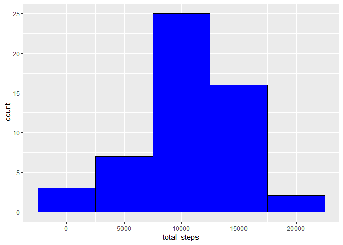
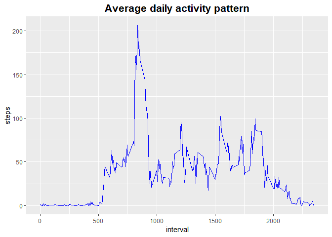
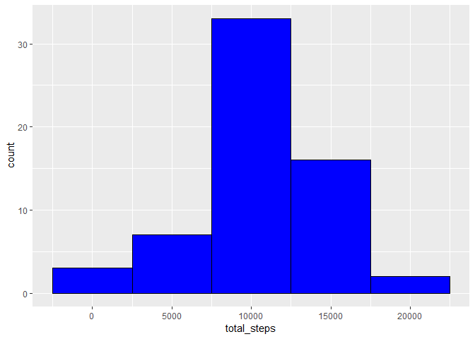
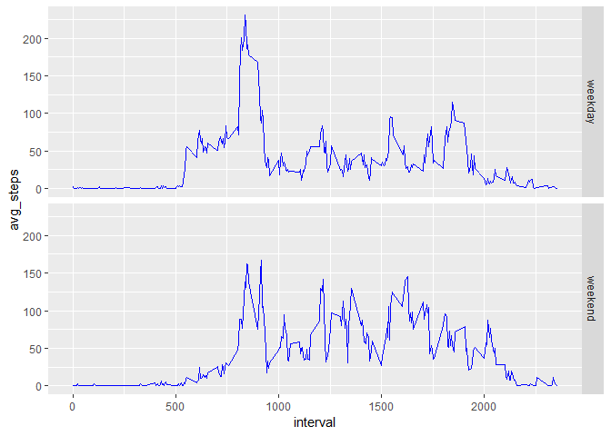

## Loading and preprocessing the data
After cloning the [GitHub repository](http://github.com/rdpeng/RepData_PeerAssessment1) for this assignment. 

Reader should load the necesary libraries  


```r
library(dplyr)
library(lubridate)
library(ggplot2)
library(tidyr)
```

Set the working directory and unzipp the activity.zip file.  

Then read the csv file and change date format.  


```r
setwd(setwd("~/R/RepData_PeerAssessment1"))
unzip("activity.zip")
data<-read.csv("activity.csv")
```
## What is mean total number of steps taken per day?

1. Make a histogram of the total number of steps taken each day  


```r
data %>% 
  tbl_df() %>% 
  mutate(date = as.Date(date)) %>% 
  group_by(day = floor_date(date, "day")) %>%
  summarise(total_steps = sum(steps)) %>% 
  ggplot(aes(x=total_steps)) + geom_histogram(color="black", fill="blue", binwidth = 5000) 
```

<!-- -->

Calculate and report the **mean** and **median** total number of steps taken per day  


```r
data %>% 
  tbl_df() %>% 
  mutate(date = as.Date(date)) %>% 
  group_by(day = floor_date(date, "day")) %>%
  summarise(total_steps = sum(steps)) %>% 
  summary() 
```

```
##       day              total_steps   
##  Min.   :2012-10-01   Min.   :   41  
##  1st Qu.:2012-10-16   1st Qu.: 8841  
##  Median :2012-10-31   Median :10765  
##  Mean   :2012-10-31   Mean   :10766  
##  3rd Qu.:2012-11-15   3rd Qu.:13294  
##  Max.   :2012-11-30   Max.   :21194  
##                       NA's   :8
```
Mean   :10766

Median :10765

## What is the average daily activity pattern?

1. Make a time series plot (i.e. `type = "l"`) of the 5-minute interval (x-axis) and the average number of steps taken, averaged across all days (y-axis)

A Tidyverse approach to process the data:  


```r
  data_ts_plot <- data %>% 
  tbl_df() %>% 
  mutate(date = as.Date(date)) %>% 
  spread(interval,steps) %>% 
  summarise_if(is.numeric, mean, na.rm = TRUE) %>% 
  gather(interval, steps) %>% 
  mutate(interval = as.integer(interval))
```

Then we use ggplot to graph:


```r
data_ts_plot %>% 
  ggplot(aes(x = interval, y = steps)) + geom_line(color="blue") + theme(plot.title = element_text(size = 16, 
    face = "bold", hjust = 0.5)) +labs(title = "Average daily activity pattern")
```

<!-- -->

2. Which 5-minute interval, on average across all the days in the dataset, contains the maximum number of steps?  


```r
data_ts_plot %>% 
    filter(steps == max(steps))
```

```
## # A tibble: 1 x 2
##   interval steps
##      <int> <dbl>
## 1      835  206.
```

The 835 interval on average across all the days in the dataset, contains the maximum number of steps.  

## Imputing missing values

1. Calculate and report the total number of missing values in the dataset (i.e. the total number of rows with NAs)  


```r
data %>% 
  tbl_df() %>% 
  summarise_all(funs(sum(is.na(.))))
```

```
## # A tibble: 1 x 3
##   steps  date interval
##   <int> <int>    <int>
## 1  2304     0        0
```

total number of missing values in the dataset = 2304

Devise a strategy for filling in all of the missing values in the dataset. The strategy does not need to be sophisticated. For example, you could use the mean/median for that day, or the mean for that 5-minute interval, etc.  

Using the mean for the 5-minute interval calculated after to make the plot, called data_ts_plot, we left join and replace the NAs in the original dataset using:


```r
data_complete <- data %>% 
  left_join(data_ts_plot, by = 'interval') %>% 
  mutate(steps_fill = ifelse(is.na(steps.x), steps.y,steps.x)) %>% 
  select(date,interval,steps_fill,-steps.x,-steps.y) %>% 
  rename(steps = steps_fill)
```

3. We create a new dataset that is equal to the original dataset but with the missing data filled in called data_complete.  

Make a histogram of the total number of steps taken each day and Calculate and report the mean and median total number of steps taken per day. 


```r
data_complete %>% 
  tbl_df() %>% 
  mutate(date = as.Date(date)) %>% 
  group_by(day = floor_date(date, "day")) %>%
  summarise(total_steps = sum(steps)) %>% 
  ggplot(aes(x=total_steps)) + geom_histogram(color="black", fill="blue", binwidth = 5000)
```

<!-- -->

Calculate and report the mean and median total number of steps taken per day.  


```r
data_complete %>% 
  tbl_df() %>% 
  mutate(date = as.Date(date)) %>% 
  group_by(day = floor_date(date, "day")) %>%
  summary() 
```

```
##       date               interval          steps       
##  Min.   :2012-10-01   Min.   :   0.0   Min.   :  0.00  
##  1st Qu.:2012-10-16   1st Qu.: 588.8   1st Qu.:  0.00  
##  Median :2012-10-31   Median :1177.5   Median :  0.00  
##  Mean   :2012-10-31   Mean   :1177.5   Mean   : 37.38  
##  3rd Qu.:2012-11-15   3rd Qu.:1766.2   3rd Qu.: 27.00  
##  Max.   :2012-11-30   Max.   :2355.0   Max.   :806.00  
##       day            
##  Min.   :2012-10-01  
##  1st Qu.:2012-10-16  
##  Median :2012-10-31  
##  Mean   :2012-10-31  
##  3rd Qu.:2012-11-15  
##  Max.   :2012-11-30
```

Mean is the same, median now is 0

## Are there differences in activity patterns between weekdays and weekends?

We create the variable weekdays with two factors:


```r
data_weekdays <- data_complete %>% 
  tbl_df() %>% 
  mutate(date = as.Date(date), weekdays = wday(date)) %>% 
  mutate(weekdays = if_else(weekdays >= 2 & weekdays <= 6, "weekday", "weekend")) %>% 
  mutate(weekdays = as.factor(weekdays)) %>% 
  group_by(interval, weekdays) %>%
  summarise(avg_steps = mean(steps)) 
```

Once we have the variables, proceed to graph:


```r
data_weekdays %>% 
  ggplot(aes(x = interval, y = avg_steps)) + geom_line(color="blue") + facet_grid(rows = vars(weekdays))
```

<!-- -->

We found similar paters but more intense activity during weekdays mornings.  
